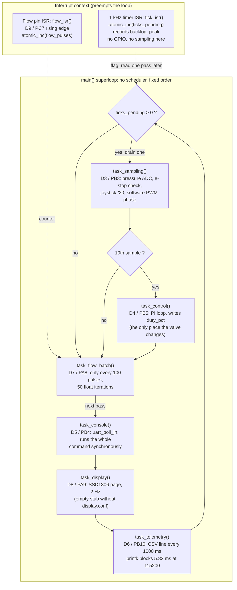

# Week 2 - Task A: superloop flow diagram

SoilSense Control, `firmware/superloop/src/main.c`, board NUCLEO-L476RG.
Ten boxes: the two interrupt sources and the eight steps the single `while (1)`
walks through. Each instrumentation GPIO is named on the box that toggles it.

## How to read it

| | |
|---|---|
| Solid arrows | the fixed visiting order of the loop. Nothing preempts it. |
| Dashed arrows | the ISR to loop hand-off. The interrupt only leaves a number behind. |
| `ticks_pending` | the queue between the 1 kHz timer and the loop. One tick is drained per pass, so a slow pass shows up here as a backlog and the worst one is kept in `backlog_peak`. Measured: 6 at idle, 416 during `calib`. |
| The console box | first in the order, and it runs a whole command to completion. This is why `calib` stalls everything: see RET §3, row 6b. |
| The telemetry box | a **soft** task holding the loop for 5.82 ms once a second on a polled UART. It is what makes the idle `backlog_peak` 6 instead of 1. |
| The e-stop path | detected in `task_sampling()` at 1 kHz, but the valve only moves in `task_control()`, one pass in ten. Detection and actuation are not the same instant, and that gap is what REQ-CTRL-02 is about. |

## Instrumentation pin map (NUCLEO-L476RG)

The six pins are the Arduino run D3 to D8, with the flow input on D9, so an
8-channel ribbon clips on in one move. Same pins on the ST Morpho CN10 odd
column, per the course overlay.

| Analyzer channel | Arduino | Port | Signal | Signature on screen |
|---|---|---|---|---|
| 1 | D3 | PB3 | `instr_samp` | narrow pulse every 1 ms |
| 2 | D4 | PB5 | `instr_ctrl` | one pulse every 10 ms, always right after a D3 pulse |
| 3 | D5 | PB4 | `instr_cons` | flat unless a key is pressed |
| 4 | D6 | PB10 | `instr_tele` | wide pulse once a second, 5.82 ms |
| 5 | D7 | PA8 | `instr_flow` | only once per 100 flow pulses |
| 6 | D8 | PA9 | `instr_disp` | flat: the HMI is not compiled in |
| 7 | D9 | PC7 | flow pulse input | the stimulus, not an instrument |
| GND | GND | | common ground | mandatory |

The overlay disables `usart1`, `pwm2` and `pwm3`, which would otherwise claim
D8/D2 and the D5/D6 timer outputs. The console stays on `usart2`, the ST-LINK
virtual COM port.
