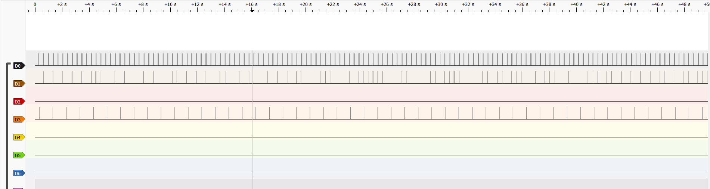
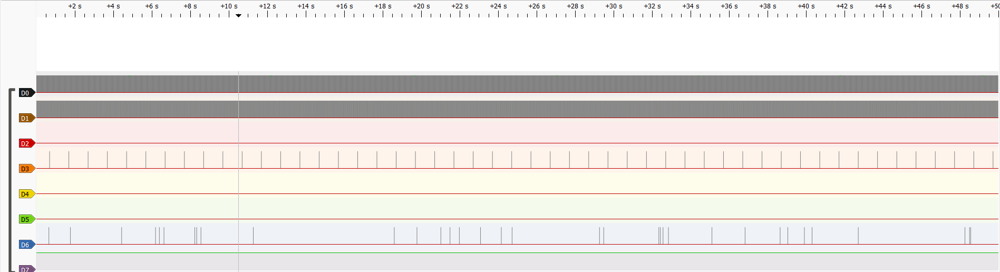
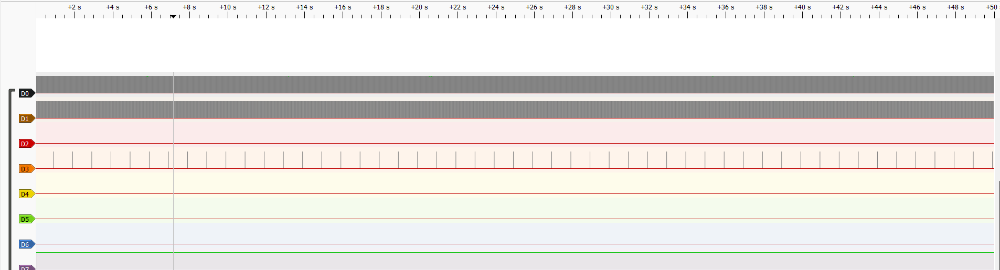
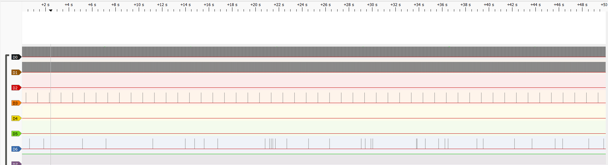

# Week 3 evidence — the C6 port and the first thread

This is the primary week-3 platform after the hardware requirement changed.
The C6 was already used for the week-1 bring-up, so this version uses the verified target
`esp32c6_devkitc/esp32c6/hpcore` and the RISC-V toolchain.

## Status

The C6 superloop was built and flashed on 2026-09-29. The generated devicetree
was checked against the physical pin map below. The Task C patch applies to the
week-2 firmware and reports queue occupancy (`backlog_peak`), release-to-thread
latency (`lat_peak_us`), and rejected releases (`ticks_dropped`). The C6
superloop baseline and sampling-thread baseline captures now exist at 4 MHz for
50 s. The two `calib` captures are still pending. Do not copy S3 numbers here.

The visual screenshot `superloop-baseline.png` and the matching VCD
`superloop-baseline.vcd` document the first C6 superloop baseline check in
PulseView. This first VCD was captured at 20 kHz for 50 s, so it is useful as
sanity evidence but not as the final high-resolution jitter capture: the 5 us
instrumentation pulses can be missed at that sample rate. The formal baseline
capture is `superloop-baseline-50s-4MHz.vcd`, with the matching screenshot
`superloop-baseline-50s-4MHz.png`. The sampling-thread baseline capture is
`thread-baseline-50s-4MHz.vcd`, with the matching screenshot
`thread-baseline-50s-4MHz.png`. The 312 MB `data.csv` is not a valid timing
input: it has no time column and contains NUL blocks starting at row 500002.
Keep it only as a record of the failed export; use VCD captures.

## Hardware port

[esp32c6_devkitc_esp32c6_hpcore.overlay](esp32c6_devkitc_esp32c6_hpcore.overlay)
defines the following map:

| Signal | C6 GPIO | Analyzer |
|---|---:|---|
| `instr_samp` | 3 | D0 |
| `instr_ctrl` | 4 | D1 |
| `instr_cons` | 5 | D2 |
| `instr_tele` | 6 | D3 |
| `instr_flow` | 7 | D4 |
| `instr_disp` | 10 | D5 |
| `flow_pulse` (input) | 11 | D6 |
| `valve_out` = `led0` | 2 | external LED + jumper to GPIO11 |

GPIO8 is deliberately unused because the C6 board's built-in indicator is an
addressable WS2812 on that pin. The valve output is therefore an external LED
on GPIO2, which was verified during the week-1 C6 bring-up. The HMI is not
enabled in this adaptation; its I2C pins must be selected from the actual board
pinctrl before adding a display.

## Available visual evidence



This screenshot is the visual proof for the first C6 superloop baseline check.
It shows the long capture window and the expected baseline shape: sampling
activity on D0, control activity on D1, telemetry activity on D3, and the
flow-related channels flat while the GPIO2->GPIO11 jumper is disconnected. Use
the corresponding VCD export to compute timing values; do not transcribe
numbers from the screenshot.

The matching VCD is `superloop-baseline.vcd`. It was captured with 8 digital
channels at 20 kHz over 50 s. Its telemetry channel is usable as a sanity check:
D3 shows 50 rising edges at 1 Hz. It is not the final timing capture requested
by the protocol, which still requires 4 MHz and 200 M samples.



The formal baseline VCD is `superloop-baseline-50s-4MHz.vcd`. It was captured
with 8 digital channels at 4 MHz over 50 s. Quick reduction confirms the
baseline signatures: D0 at 999.859 Hz, D1 at 99.986 Hz, D3 at 1.000 Hz with 50
rising edges, and D2/D4/D5/D7 flat. D6 has sparse edges and is not the intended
50 Hz flow stimulus, so this file is a baseline capture, not a flow or `calib`
capture.



The sampling-thread baseline VCD is `thread-baseline-50s-4MHz.vcd`. It was
captured with 8 digital channels at 4 MHz over 50 s. Quick reduction confirms
the baseline signatures: D0 at 999.859 Hz, D1 at 99.986 Hz, D3 at 1.000 Hz with
50 rising edges, and D2/D4/D5/D6/D7 flat. This file is a baseline capture, not a
flow or `calib` capture.



`thread-calib-flow-attempt-50s-4MHz.vcd` is an attempted fourth capture at 4 MHz
over 50 s. It is kept as a record of the attempt, but it is not the official
`thread-calib-flow-50s-4MHz.vcd`: D2 stayed flat, D4 stayed flat, and D6 showed
only 43 sparse edges rather than the expected 50 Hz flow stimulus. Do not use it
to fill the `calib` or flow rows in the RET.

## Builds

```bash
source ~/zephyrproject/.venv/bin/activate
FW=~/4101137-real-time-systems-upstream
EVID=~/Real-time-systems/evidencia/lab03/c6
cd ~/zephyrproject

# column 2 — C6 superloop
west build -p -b esp32c6_devkitc/esp32c6/hpcore \
	--build-dir build-lab03-c6-superloop $FW/firmware/superloop
west flash --build-dir build-lab03-c6-superloop

# column 3 — C6 plus sampling thread
git -C $FW apply --check $EVID/lab03-task-c.patch
git -C $FW apply $EVID/lab03-task-c.patch
west build -p -b esp32c6_devkitc/esp32c6/hpcore \
	--build-dir build-lab03-c6-thread $FW/firmware/superloop
west flash --build-dir build-lab03-c6-thread
```

The patch is platform-independent. Apply it only for column 3. Reverse it with
`git -C $FW apply --reverse $EVID/lab03-task-c.patch` before returning to the
superloop build. The S3 folder is optional comparison evidence, not a
prerequisite for the C6 lab.

## Contents and capture protocol

Keep the raw captures, reductions, figures and console transcript beside this
README, following the week-2 evidence layout:

| Artifact | Conditions |
|---|---|
| `superloop-baseline.vcd` | First C6 superloop baseline capture, 20 kHz for 50 s; visual/sanity evidence, not final jitter evidence. |
| `superloop-baseline-50s-4MHz.vcd` | Superloop baseline, 4 MHz for 50 s, jumper removed, no console input. |
| `superloop-calib-flow-50s-4MHz.vcd` | Superloop, GPIO2→GPIO11 jumper, `calib` near t=28 s. |
| `thread-baseline-50s-4MHz.vcd` | Sampling-thread baseline, 4 MHz for 50 s, jumper removed, no console input. |
| `thread-calib-flow-50s-4MHz.vcd` | Sampling-thread build, jumper installed, `calib` near t=28 s. |
| `thread-calib-flow-attempt-50s-4MHz.vcd` | Attempted sampling-thread `calib`/flow capture; not valid for RET timing rows because `calib` and 50 Hz flow are absent. |
| `console-session.txt` | Current C6 serial smoke test. The `status`/`calib`/`status` transcripts are still pending for the two `calib` captures. |
| `*-stats.txt` | Results from the week-2 VCD reduction scripts. |
| `fig-*.svg` | Selected windows rendered from committed VCDs. |

Use PulseView with `fx2lafw`, eight digital channels, 4 MHz and 200 M samples
(49.999 s). Export **VCD**, not CSV, and retain channel names D0-D7. For the
baseline, disconnect GPIO2→GPIO11 and do not type during the capture. D0 should
be a 1 kHz train, D1 a 100 Hz train, and D3 one pulse per second; D6 and D4
should be flat. With the jumper installed, D6 should carry the valve's 50 Hz
stimulus and D4 should pulse once per 100 flow edges (about every 2 s).

The CH343 is attached to WSL as `/dev/ttyACM0`. Keep the WSL serial monitor at
115200 8N1. For each `calib` capture, start the analyzer first, issue `status`,
send `calib` around t=28 s, then issue `status` again. Save that console output.
The thread build reports `backlog_peak`, `lat_peak_us`, and `ticks_dropped`.

The current clone already has the week-2 Tasks 1-3 patch applied. On a fresh
course clone, apply `~/Real-time-systems/evidencia/lab02/lab02-tasks123.patch`
once before building the superloop; do not apply it again to the current clone.

## Reduction and figures

Run the existing scripts from WSL after each VCD has been exported:

```bash
SCRIPTS=~/Real-time-systems/evidencia/lab02
EVID=~/Real-time-systems/evidencia/lab03/c6
python $SCRIPTS/vcd_stats.py $EVID/superloop-baseline-50s-4MHz.vcd \
	> $EVID/superloop-baseline-stats.txt
python $SCRIPTS/vcd_calib.py $EVID/superloop-calib-flow-50s-4MHz.vcd \
	> $EVID/superloop-calib-flow-stats.txt
python $SCRIPTS/vcd_stats.py $EVID/thread-baseline-50s-4MHz.vcd \
	> $EVID/thread-baseline-stats.txt
python $SCRIPTS/vcd_calib.py $EVID/thread-calib-flow-50s-4MHz.vcd \
	> $EVID/thread-calib-flow-stats.txt

python $SCRIPTS/vcd_plot.py $EVID/superloop-baseline-50s-4MHz.vcd \
	$EVID/fig-superloop-baseline.svg "C6 superloop baseline"
python $SCRIPTS/vcd_plot.py $EVID/superloop-calib-flow-50s-4MHz.vcd \
	$EVID/fig-superloop-calib.svg "C6 superloop during calib"
python $SCRIPTS/vcd_plot.py $EVID/thread-calib-flow-50s-4MHz.vcd \
	$EVID/fig-thread-calib.svg "C6 sampling thread during calib"
```

The C6 is RISC-V while the optional S3 is Xtensa. Report them as separate
measurements even when they run identical C code. Linker footprints were
133,556 B FLASH / 51,088 B RAM for the superloop and 133,636 B FLASH / 53,696 B
RAM for the thread build. Baseline timing captures exist for both the superloop
and sampling-thread builds. The remaining C6 timing work is the two `calib`/flow
captures and their console transcripts.
