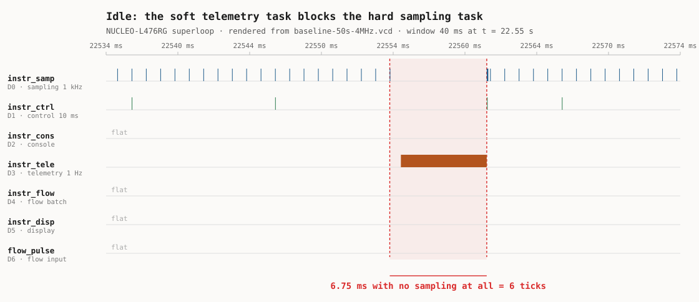
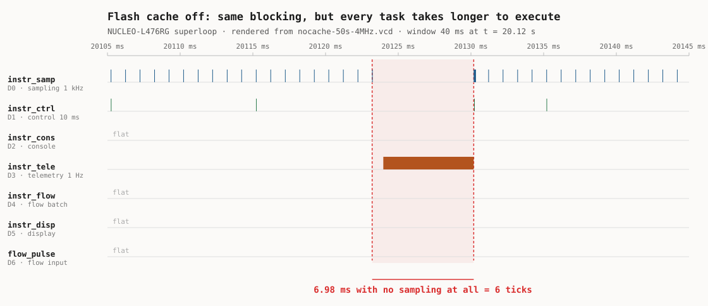
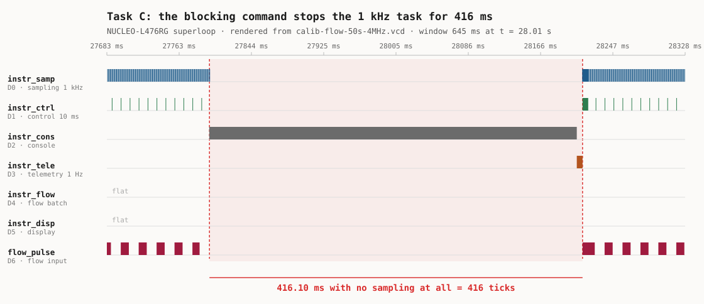

# RET — Timing Evidence Report

**Team:** Joshua · David Henao Rojas · Ismael Cortés Ramírez
**Boards:** NUCLEO-L476RG (weeks 1–2) · ESP32-S3-DevKitC (from week 3)
**Living** document: updated every week; handed in at the workshop (week 8) and
at the close (week 16).
House rule: *"show me the trace"* — every timing claim cites a measurement.

## 1. The system and its task set

Requirements first — one sentence each, EARS style (*when/while <condition>, the
system shall <response> within <deadline>*) — then the task that implements them:

| ID | Requirement | Type | Where the number comes from |
|---|---|---|---|
| REQ-CTRL-01 | While the system is irrigating, the control loop shall recompute the valve command every 10 ms, with a deadline equal to its period. | Hard | Given by the scenario (task table). |
| REQ-CTRL-02 | When line pressure exceeds 3000 mV, the system shall drive the valve command to zero within 5 ms of the sample that detected it. | Hard | Given by the scenario (`response < 5 ms`); the threshold is `ESTOP_MV` in `main.c`. |
| REQ-CTRL-03 | While the system is irrigating, the system shall sample pressure every 1 ms with an absolute period error no greater than 100 µs. | Hard | The 1 kHz period is given by the scenario. The 100 µs bound is our budget, 10 % of the period, so the PI loop can treat the sampling instant as uniform. |
| REQ-CTRL-04 | While the system is irrigating, the system shall service each 1 kHz sampling tick before the next one arrives, so that no more than 1 tick is ever pending. | Hard | Derived from REQ-CTRL-03. The firmware's own `backlog_peak` counter is the verification instrument. |
| REQ-CTRL-05 | When a flow sensor pulse arrives on the flow input, the system shall count it without loss for input rates up to 500 Hz. | Hard | YF-S401 at its rated maximum flow (5880 pulses/L, `main.c`), rounded up. |
| REQ-CTRL-06 | While the link to the Hub is up, the system shall emit one telemetry frame every 1000 ms, tolerating a delay of up to 100 ms. | Soft | Period given by the scenario. Late frames degrade the dashboard, they do not break the plant. |
| REQ-CTRL-07 | When an operator command arrives on the console, the system shall complete the response within 200 ms. | Firm | A late console answer is worthless but harmless. 200 ms is the human perception limit we adopt. |
| REQ-CTRL-08 | While a maintenance command is executing, the system shall continue to meet REQ-CTRL-03 and REQ-CTRL-04. | Hard | Our own requirement. Week 2's Task C exists to test exactly this one, and the superloop is expected to fail it. |

### Measured task set

`C_i` is the instrumentation pulse width on the analyzer, mean over a 49.999 s
capture at 4 MHz (250 ns resolution). Verdicts are justified in §3.

| Task | Req. | Type | Period T | Deadline | **Measured C_i** (min / mean / max) | U = C/T | Verdict |
|---|---|---|---|---|---|---|---|
| Sensor sampling (`task_sampling`, D3/PB3) | REQ-CTRL-03, 04 | Hard | 1 ms | = T | 4.50 / **4.95** / 5.50 µs | 0.495 % | **fails**, see §3 rows 1–2 |
| Control loop (`task_control`, D4/PB5) | REQ-CTRL-01 | Hard | 10 ms | = T | 1.25 / **1.35** / 1.50 µs | 0.014 % | **fails**: 1.00 % of periods without the flow sensor, 15.1 % with it |
| Emergency stop (path sampling → control) | REQ-CTRL-02 | Hard | sporadic | 5 ms | bounded by the control period | — | **fails**, worst case 14.77 ms |
| Telemetry (`task_telemetry`, D6/PB10) | REQ-CTRL-06 | Soft | 1000 ms | 1100 ms | 5978.00 / **5980.36** / 5982.50 µs | 0.598 % | **passes**, period 998.74–999.28 ms |
| Command console (`task_console`, D5/PB4) | REQ-CTRL-07, 08 | Firm | sporadic | 200 ms | not exercised in the baseline capture | — | `calib` **fails** REQ-CTRL-08, §3 row 6b |
| Flow pulse count (`flow_isr` + `task_flow_batch`, D7/PA8) | REQ-CTRL-05 | Hard | sporadic, batched /100 (2 s at 50 Hz) | best effort | 70.50 / **70.62** / 70.75 µs | 0.004 % | **passes**, 100.1 pulses per batch, no loss |
| Flow pulse **interrupt** (`flow_isr`, no GPIO of its own) | REQ-CTRL-05 | Hard | sporadic | — | **11.50 µs** (inferred, see §3) | — | it alone breaks REQ-CTRL-01, see §3 |

**Total measured utilisation U = 1.169 %** (1.106 % without the flow sensor
connected). The CPU is idle 98.83 % of the time and the hard deadlines are
missed anyway. That single sentence is the case for module 2, and §3 is where it
is earned.

## 2. ADRs

### ADR-001 — <title>
**Context:** … · **Decision:** … · **Justification (with numbers):** … · **Status:** …

> The superloop-versus-kernel decision belongs to week 4, once the A/B exists.
> Week 2 gathers the evidence that will justify it, and §3 already contains the
> numbers that argument will rest on.

## 3. Evidence by week

Each entry cites the `REQ`(s) it verifies.

### Week 2 — superloop baseline (NUCLEO-L476RG)

**Measurement conditions.** NUCLEO-L476RG (STM32L476RG, Cortex-M4F at 80 MHz),
Zephyr 4.4.0, Zephyr SDK 1.0.1, `arm-zephyr-eabi` 14.3.0, built with
`west build -p -b nucleo_l476rg firmware/superloop`. Footprint FLASH 25 492 B of
1 MB (2.43 %), RAM 3 840 B of 96 KB (3.91 %). Flashed by copying `zephyr.bin` to
the ST-LINK mass storage volume (`NODE_L476RG`, ST-LINK V2J46M31); no `FAIL.TXT`
produced. Console on the ST-LINK VCP, 115200 8N1. Pressure from the synthetic
plant, setpoint 1500 mV, no pot wired, HMI not compiled in.

Instrument: Saleae Logic clone (`0925:3881`, Cypress FX2), PulseView with the
`fx2lafw` driver, **8 channels at 4 MHz** (250 ns resolution), **capture 49.999 s**,
exported to VCD and reduced with `evidencia/lab02/vcd_stats.py`. Load during the
capture: the node idle, nothing typed on the console, telemetry free-running.

Channel map verified against the signals, not assumed: PulseView `Dn` is Nucleo
`D(n+3)`. D2, D4, D5 and D6 are flat in the baseline, which is the expected
result (console untouched, no flow stimulus, HMI not compiled in).

| # | Measurement | Verifies | **Our value** | Reference |
|---|---|---|---|---|
| 1 | Actual sampling period (nominal 1 kHz), average | REQ-CTRL-03 | **999.02 µs** | 1000 µs |
| 2 | Sampling jitter, max over 49.999 s | REQ-CTRL-03 | **6753.25 µs** (clean regime: 10.75 µs) | **the course baseline** |
| 3 | ISR → loop-service latency (flow pulse) | REQ-CTRL-05 | **9.67 µs** (deterministic stimulus, see below) | |
| 4 | Sampling jitter, max, flash cache off | REQ-CTRL-03 | **119.25 µs** clean regime (6979.00 µs total) | 11x row 2: that gap is the ART accelerator |
| 5 | Sampling jitter, max, with `calib` running | REQ-CTRL-08 | **416 110 µs** (416.11 ms) | 61.5× row 2 |
| 6 | `backlog_peak`, idle → during `calib` | REQ-CTRL-04, 08 | **6 → 416 ticks** | measured, §3 row 6 |

**Reading.** The superloop keeps a 1 kHz sampling grid to within ±6.25 µs for
99.30 % of its passes and then misses it by 5.77 ms once a second, because a
soft task holds the only thread of control; the CPU is 98.89 % idle throughout,
so the failure is architectural, not a shortage of cycles. The control loop
carries 13.00 µs of margin on a 10 ms deadline, so a single 11.50 µs GPIO
interrupt is enough to break it, and connecting the flow sensor does exactly
that 29 % of the time.

#### Rows 1 and 2 — the sampling grid has three regimes, not one



*The 1 ms sampling train on D0 stops for the whole width of the telemetry
pulse on D3, then resumes with the catch-up burst visible as a tight
cluster. Rendered from the committed capture by
`evidencia/lab02/vcd_plot.py`.*

Reducing 50 049 sampling pulses to a single "jitter" number hides what is
actually happening. Classified by period:

| Regime | Periods | Share | min | mean | max |
|---|---|---|---|---|---|
| **1. Normal pass** | 49 698 | 99.30 % | 993.75 µs | 999.02 µs | 1004.50 µs |
| **2. Blocked by telemetry** | 50 | 0.10 % | 6754.50 µs | 6759.95 µs | 6765.25 µs |
| **3. Catch-up (backlog drain)** | 300 | 0.60 % | 12.00 µs | 39.08 µs | 173.25 µs |

- **Regime 1 meets REQ-CTRL-03 comfortably**: worst deviation from the 1000 µs
  grid is 6.25 µs, against a 100 µs budget. Jitter within the regime is 10.75 µs.
  The superloop is not a sloppy architecture; when nothing interferes it is
  excellent.
- **Regime 2 is one telemetry line.** Exactly 50 events in 49.999 s, one per
  second, and `instr_tele` on D6 measures 5980.36 µs mean. REQ-CTRL-03 is
  violated by 5765.25 µs, **57× the budget**.
- **Regime 3 is the queue draining.** 300 periods over 50 events is **exactly
  6.0 per event**, and it is the same 6 the firmware reported as
  `backlog_peak = 6` over the console.

**Three independent routes to the same number.** The firmware's own counter says
6 ticks. The UART arithmetic says the telemetry line is 69 characters, so at
115200 8N1 with 10 bits per character it occupies 69 × 10 / 115200 = 5.99 ms,
which spans 6 ticks. The analyzer measures the pulse at 5.980 ms and counts 6
catch-up periods after each one. Agreement to better than 0.2 %.

**Why this is worse than losing the samples.** The ticks are not dropped, they
are queued: the node still takes its 1000 samples per second. But six of them
are taken **bunched inside 173 µs** after a 6.76 ms gap. `task_control()`
integrates with

```c
integral_mv += error / 8;
```

which assumes uniformly spaced samples. Six samples arriving in an interval in
which the plant has essentially not moved wind the integrator six times for one
instant of physical time. A sample taken at the wrong moment is not the same
thing as a sample taken late, and neither is visible in an "average period" of
999.02 µs.

#### Row 3 — flow pulse service latency = 9.67 µs, with a caveat

Second capture, 49.999 s at 4 MHz, identical build, with one jumper added from
**D13 (PA5, the valve output) to D9 (PC7, the flow input)**. No extra hardware:
the node's own valve drives its own flow sensor, which is also what happens
physically, since flow exists because the valve is open.

```
flow input pulses on D9 : 2502   (50.0 Hz, the valve's software PWM: 1 kHz / 20)
batch events on D7      : 25     (one per 2.0 s)
pulses per batch        : 100.1  (FLOW_BATCH = 100, as expected)
```

| | min | mean | max |
|---|---|---|---|
| 100th pulse → `instr_flow` rising | 9.50 µs | **9.67 µs** | 9.75 µs |
| `C_i` of `task_flow_batch` | 70.50 µs | **70.62 µs** | 70.75 µs |

**Measurement caveat, and it matters.** The stimulus is not asynchronous. The
valve output is written inside `task_sampling()`, so every flow edge arrives at
the *same point of the loop cycle*, which is why 25 events spread over only
250 ns. A real YF-S401 is asynchronous and would land anywhere in the cycle,
producing a spread bounded by one full superloop pass rather than this constant.
**9.67 µs is the deterministic case, not the worst case**, and the row should be
read that way until a free-running source is available.

`C_i = 70.62 µs` for `task_flow_batch` is worth noting on its own: 14× the
sampling task, for 50 iterations of

```c
flow_lpm = flow_lpm * 0.9f + lpm * 0.1f;
```

which is ~113 cycles per iteration at 80 MHz. The hardware FPU is not being
used; these are software float routines, exactly as the source comment warns.

#### Row 5 — `calib` under the analyzer = 416.11 ms

Same capture, with `calib` issued over the console 27.8 s in.

| | |
|---|---|
| Worst sampling period | **416.11 ms** at t = 27.797 s |
| Ticks it spans | **416** |
| Against row 2 (6.77 ms) | **61.5× worse** |
| Next longest periods | 7.26, 7.13, 7.12, 7.12, 7.12 ms (telemetry) |
| Catch-up burst after it | 421 periods, mean 13.33 µs, **5.61 ms total** |

`backlog_peak` read 416 over the console; the analyzer measures 416.11 ms, which
is 416 ticks. The firmware's counter and the trace agree exactly.

The catch-up figure is the part that does not appear in any table the lab asks
for: **416 samples that should have been spread over 416 ms are taken inside
5.61 ms**, compressed by a factor of 74. The samples are not lost, they are
worthless: they are all taken at an instant when the plant has not moved, and
`integral_mv += error / 8` winds the integrator 416 times for it.

#### An unplanned finding: the telemetry `C_i` depends on the data it prints

| Capture | `instr_tele` pulse width | Line printed |
|---|---|---|
| Baseline | 5980.36 µs | `t=29000 ... backlog=7` (69 chars) |
| Second | 6236.26 µs | `t=2167000 ... flow_x100=102 backlog=416` (~72 chars) |

The blocking time grew by 256 µs because the uptime reached seven digits, the
flow reading went from `0` to `102` and the backlog from `7` to `416`. On a
polled UART the task's execution time is literally proportional to the number of
characters formatted, so **`C_i` of `task_telemetry` is data-dependent**. A WCET
for it cannot be measured by observing a typical run; it has to be bounded by
the longest line the format string can produce. This is a module 3 problem and
it is recorded here so it is not rediscovered then.

#### The measurement that changes the conclusion: one interrupt exhausts the margin

The second capture shows 756 of 5002 control periods over the 10 ms deadline,
against 50 of 5004 in the baseline. The two differ only by the jumper, so the
cause was isolated with a controlled comparison **inside the same capture**:
every control period was classified by whether a flow interrupt fired inside it,
after discarding the periods containing a telemetry line or a flow batch. Same
board, same binary, same 50 seconds; the interrupt is the only variable left.

| Flow ISRs in the period | Count | Median | p5 | p95 | Over 10 ms |
|---|---|---|---|---|---|
| **0** | 2404 | 9987.00 µs | 9982.50 | 9991.25 | **0.0 %** |
| **1** | 2428 | 9998.50 µs | 9993.25 | 10002.25 | **29.0 %** |

| | |
|---|---|
| Cost of a single GPIO interrupt | **+11.50 µs** |
| Margin of the control loop against its deadline | **13.00 µs** (0.13 % of the period) |

**One interrupt consumes 88 % of the control loop's entire timing margin.**

With no flow sensor connected the loop meets REQ-CTRL-01 on every single period.
Connect a sensor that pulses at 50 Hz, change not one line of code, and 29 % of
the periods that contain a pulse miss the deadline. The node passes on the bench
and fails in the field on the day the flow meter is plugged in.

The root cause is not the interrupt, which is cheap. It is that the design left
0.13 % of margin: `task_control()` runs every tenth serviced sample, so its
period is ten sampling periods, 9.99 ms, and the deadline is 10 ms. A margin
that thin is not a margin, and nothing in a functional test would ever reveal it.
This is the single strongest argument in the week-2 evidence for what module 2
proposes, and it is the number ADR-001 should open with.

#### Row 4 — what the ART accelerator was doing, isolated



*The same view as the baseline figure, with the cache off. The telemetry
blocking is essentially unchanged (6.98 ms against 6.75 ms) because it is
UART-bound, while the execution time of every compute task grew 47-86 %.*

Third capture, 49.999 s at 4 MHz, jumper removed so the conditions match the
baseline exactly. Identical source, identical pins, identical clock; the only
difference is the build:

```bash
west build -p -b nucleo_l476rg firmware/superloop -- -DEXTRA_CONF_FILE=nocache.conf
```

Verified in the generated configuration before trusting the capture, because on
the wrong SoC series this fragment does nothing at all:

```
CONFIG_LAB_FLASH_CACHE_OFF=y                    (satisfied: depends on SOC_SERIES_STM32L4X)
# CONFIG_STM32_FLASH_PREFETCH is not set
build-nocache/CMakeFiles/app.dir/src/cache_stm32l4.c.obj   (compiled in)
```

`src/cache_stm32l4.c` runs `LL_FLASH_DisableInstCache()` and
`LL_FLASH_DisableDataCache()` from `SYS_INIT(..., PRE_KERNEL_1, 0)`, undoing what
Zephyr's `soc_early_init_hook()` enabled.

| Task | C_i, cache ON | C_i, cache OFF | Penalty |
|---|---|---|---|
| `task_sampling` | 4.95 µs | **7.28 µs** | **+47.0 %** |
| `task_control` | 1.35 µs | **2.51 µs** | **+85.8 %** |
| `task_telemetry` | 5980.36 µs | 6217.19 µs | +4.0 % raw, **~+1.1 % real** |

**The telemetry figure needs a correction, and it is instructive.** In the
cache-off capture `flow_lpm` still held its last value from the previous run, so
the printed line carried `flow_x100=102` instead of `flow_x100=0`: two extra
characters, which at 115200 8N1 cost 2 × 10 / 115200 = 173 µs of the 237 µs
difference. The genuine cache penalty on this task is therefore about 64 µs,
roughly +1.1 %. Reporting the raw 4 % would be attributing to the cache
something that was mostly the data. It is the same data-dependent `C_i` noted
earlier, this time showing up as a confound rather than a finding.

**The result, stated properly.** Code that executes out of flash gets 47 % to
86 % slower without the accelerator. A task whose time is spent waiting on a
115200 baud UART does not, because the bits leave the peripheral at the same
rate no matter how fast the core runs. The split between CPU-bound and I/O-bound
work is visible in a single table, which is what this row exists to teach.

| Sampling period, normal regime | n | min | mean | max | jitter |
|---|---|---|---|---|---|
| cache ON | 49 698 | 993.75 µs | 999.02 µs | 1004.50 µs | **10.75 µs** |
| cache OFF | 49 703 | 888.00 µs | 998.83 µs | 1007.25 µs | **119.25 µs** |

**Row 4 = 119.25 µs in the clean regime (6979.00 µs including the telemetry
excursion), against row 2's 10.75 µs: 11× worse.**

The mean period is unchanged (998.83 vs 999.02 µs) because the timer still fires
at 1 kHz; what degrades is the loop's ability to *arrive on time*, which is
exactly what jitter measures and what an average hides.

And the verdict that matters: **disabling the flash accelerator, on its own,
breaks REQ-CTRL-03.** The budget is 100 µs and the worst deviation without the
ART is 112 µs. With it, 6.25 µs. No line of code changed. A hardware feature
nobody declared was holding up a timing requirement, and nothing in the
requirement, the code or a functional test records that dependency. That is
worth an ADR of its own when module 3 comes to write WCET down.

The telemetry blocking barely moved: 6.76 ms to 6.99 ms, +3.43 %, and part of
that is the same two extra characters. The I/O bound is untouched by the cache,
as it should be.

#### Row 6a — idle `backlog_peak` = 6 ticks, REQ-CTRL-04 fails at idle

With nobody touching the board, `backlog_peak` settles at **6**, not 1.
`task_telemetry()` ends in

```c
printk("%s\n", line); /* polled UART: ~7 ms of blocking at 115200 */
```

on a polled UART that does not yield, and the 69-character line occupies the
loop for 5.98 ms, once per second. Six 1 kHz ticks fall inside that window.

The consequence is the interesting part: the **soft** task is already consuming
the **hard** task's deadline before any fault is injected. REQ-CTRL-04 is
violated 50 times in 50 seconds, at idle, on a system that is 98.89 % idle.

#### Row 6b — `backlog_peak` = 416 ticks during `calib` (Task C)



*416.10 ms in which the 1 kHz task does not run once. Three things to read
off it. `instr_cons` on D2 stays **high for the entire window**, so the
console task is visibly the one holding the loop. `flow_pulse` on D6 stops
pulsing, because the valve PWM that generates it is written inside
`task_sampling()`, which is not running either. And the control task on D1
is silent throughout, which is REQ-CTRL-01 and REQ-CTRL-02 failing
together.*

```
status  (before) → backlog_peak=6
calib            → calibrating zero-flow offset (1000 rounds)...
status  (after)  → backlog_peak=416
```

**Root cause.** `cmd_calib()`, `firmware/superloop/src/main.c:400`:

```c
for (int i = 0; i < CALIB_ROUNDS; i++) {   /* CALIB_ROUNDS = 1000 */
        (void)read_pressure_mv();
        k_busy_wait(400);                  /* line 405 */
}
```

It is reached synchronously: `cmd_calib()` from `console_handle()` (line 430),
from `task_console()` (line 448), which is the **first** call in the superloop
(line 498). `k_busy_wait()` spins on the CPU without yielding, and there is no
scheduler that could take it away.

    1000 × 400 µs of busy wait        = 400 ms
    1000 ADC reads at roughly 16 µs   =  16 ms
                                        ------
                                        416 ms

416 ms in which the loop never reaches `task_sampling()`, against a timer that
fires every 1 ms: **416 ticks**. Measured: 416.

The telemetry timestamps corroborate it: the frame due at `t=30000` arrived at
`t=30123`, so the same command pushed the soft task 123 ms late.

**Which task suffers, and why.** The victim is `task_sampling()`, the hard 1 kHz
task, and the culprit is a **firm** console command. Not because the command is
long in itself, but because the superloop cannot preempt it: a single `while (1)`
visiting fixed call sites means the longest call in the cycle sets the worst-case
delay for every other task. REQ-CTRL-08 fails, and REQ-CTRL-04 fails by 416
pending ticks against a limit of 1.

#### The control loop misses its own deadline, measured

D4 (`instr_ctrl`), same capture, 5004 periods:

| | |
|---|---|
| min | 5210.75 µs |
| mean | 9990.20 µs |
| max | **14 771.25 µs** |
| periods longer than the 10 ms deadline | **50 of 5004 (1.00 %)** |
| worst overrun | 4771.25 µs, **48 % over the deadline** |

**REQ-CTRL-01 fails**, once per second, for the same root cause: `task_control()`
runs every tenth *serviced* sample, and when six samples are serviced back to
back the control instants bunch with them. The mean of 9990.20 µs looks perfect
and hides 50 violations.

**REQ-CTRL-02 fails with it.** Overpressure is *detected* in `task_sampling()` at
1 kHz:

```c
if (pressure_mv > ESTOP_MV) {
        estop = true; /* ...but the valve only reacts when control runs */
}
```

but `duty_pct` is only written in `task_control()`. The worst case from
detection to actuation is therefore bounded by the measured worst control period,
**14.77 ms against a 5 ms deadline**: nearly 3× over. This is no longer an
argument from reading the code, it is a measured bound, and it is the direct
input to week 4's superloop-versus-kernel ADR.

#### Utilisation: the point of the whole session

| Task | C_i | T | U |
|---|---|---|---|
| sampling | 4.95 µs | 1 ms | 0.495 % |
| control | 1.35 µs | 10 ms | 0.014 % |
| telemetry | 5980.36 µs | 1000 ms | 0.598 % |
| flow batch | 70.62 µs | 2000 ms | 0.004 % |
| flow ISR | 11.50 µs | 20 ms | 0.058 % |
| | | **Total** | **1.169 %** |

The processor is idle **98.83 %** of the time and three hard requirements
(REQ-CTRL-01, 03, 04) are violated once per second anyway. Adding a faster MCU
would not fix any of them. What is missing is not cycles, it is the ability to
take the CPU away from whoever is holding it.

The flow ISR makes the point sharper than the totals do. It contributes
**0.058 %** of the CPU and it is sufficient, on its own, to push 29 % of the
control periods past their deadline, because the deadline miss is decided by
*when* the 11.50 µs lands, not by how much of the second it consumes.
Utilisation is the wrong instrument for this failure, which is precisely why
module 3 replaces it with response-time analysis.

### Week 3 — S3 baseline and silicon comparison
…

## 4. Schedulability analysis

Measured `C_i` from §1. With U = 1.106 % the utilisation-bound tests (RM,
hyperbolic, EDF) all pass trivially, which is precisely why they are not the
whole story here: the task set is schedulable on paper and misses deadlines in
practice, because a superloop provides no preemption and the blocking term is
the full length of the longest call in the cycle, not a bounded critical
section. Formal RTA with the blocking term `B_i` belongs to module 3, and the
5.98 ms telemetry call and the 416 ms `calib` call are the two `B_i` values it
will have to carry.

## 5. Functional safety (final project)

Declared safe state (failure ⇒ valve closed), watchdog, and the evidence of the
fail-safe firing.
