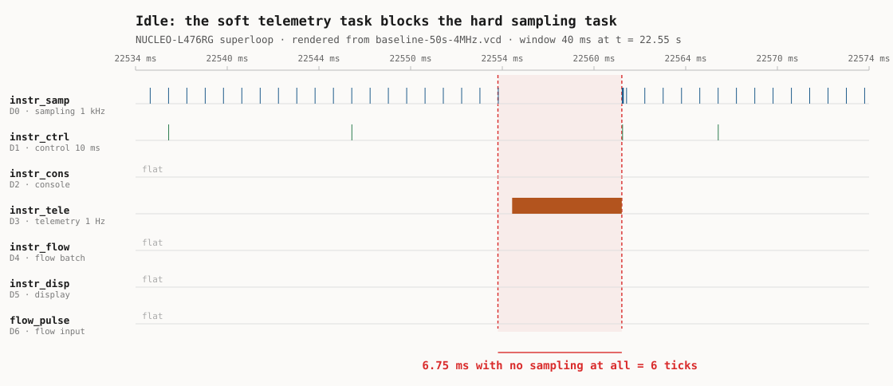
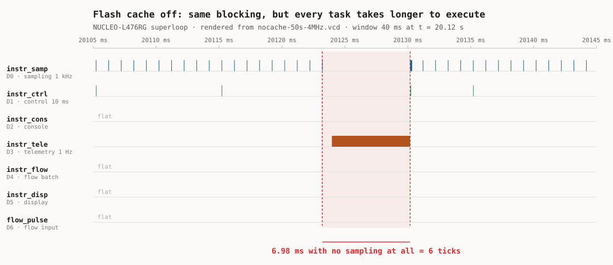
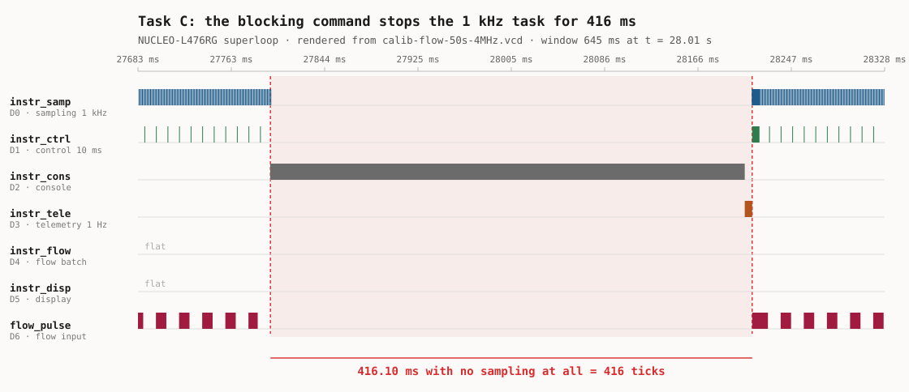
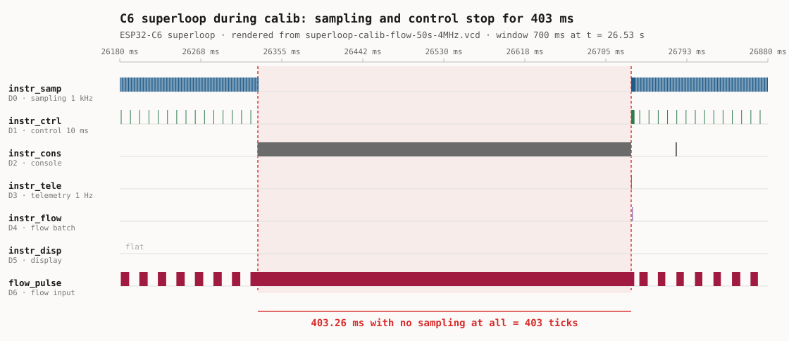
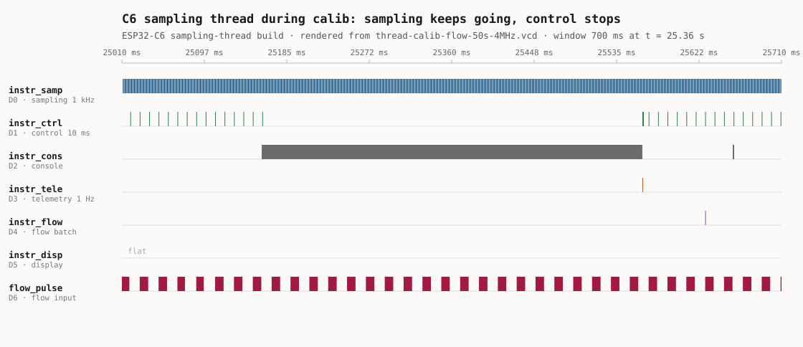
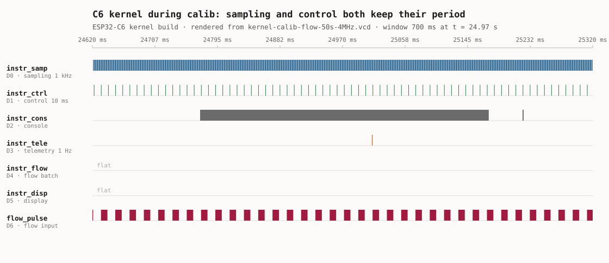
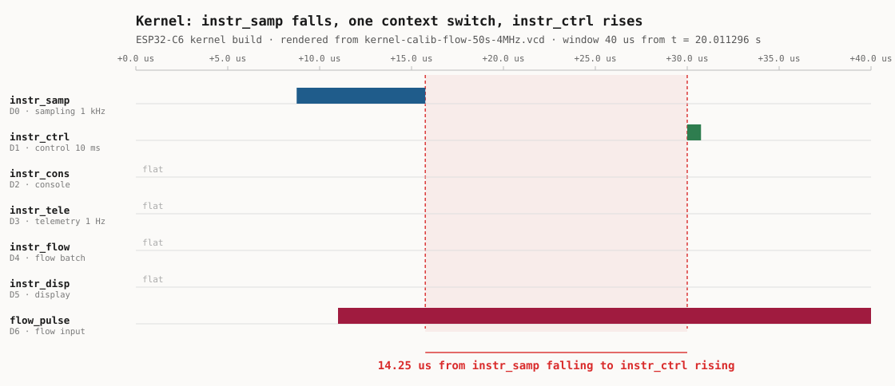

# RET — Timing Evidence Report

**Team:** Joshua · David Henao Rojas · Ismael Cortés Ramírez
**Boards:** NUCLEO-L476RG (weeks 1–2) · ESP32-C6-DevKitC (from week 3)
**Optional comparison:** ESP32-S3-DevKitC
**Living** document: updated every week; handed in at the workshop (week 8) and
at the close (week 16).
House rule: *"show me the trace"* — every timing claim cites a measurement.

## 1. The system and its task set

Requirements first — one sentence each, EARS style (*when/while <condition>, the
system shall <response> within <deadline>*) — then the task that implements them:

| ID | Requirement | Type | Where the number comes from |
|---|---|---|---|
| REQ-CTRL-01 | While the system is irrigating, the control loop shall recompute the valve command every 10 ms, with a deadline equal to its period. | Hard | Given by the scenario (task table). |
| REQ-CTRL-02 | When line pressure exceeds 3000 mV, the system shall drive the valve command to zero within 5 ms of the sample that detected it. | Hard | Given by the scenario (`response < 5 ms`); the threshold is `ESTOP_MV` in `main.c`. |
| REQ-CTRL-03 | While the system is irrigating, the system shall sample pressure every 1 ms with an absolute period error no greater than 100 µs. | Hard | The 1 kHz period is given by the scenario. The 100 µs bound is our budget, 10 % of the period, so the PI loop can treat the sampling instant as uniform. |
| REQ-CTRL-04 | While the system is irrigating, the system shall service each 1 kHz sampling tick before the next one arrives, so that no more than 1 tick is ever pending. | Hard | Derived from REQ-CTRL-03. The firmware's own `backlog_peak` counter is the verification instrument. |
| REQ-CTRL-05 | When a flow sensor pulse arrives on the flow input, the system shall count it without loss for input rates up to 500 Hz. | Hard | YF-S401 at its rated maximum flow (5880 pulses/L, `main.c`), rounded up. |
| REQ-CTRL-06 | While the link to the Hub is up, the system shall emit one telemetry frame every 1000 ms, tolerating a delay of up to 100 ms. | Soft | Period given by the scenario. Late frames degrade the dashboard, they do not break the plant. |
| REQ-CTRL-07 | When an operator command arrives on the console, the system shall complete the response within 200 ms. | Firm | A late console answer is worthless but harmless. 200 ms is the human perception limit we adopt. |
| REQ-CTRL-08 | While a maintenance command is executing, the system shall continue to meet REQ-CTRL-03 and REQ-CTRL-04. | Hard | Our own requirement. Week 2's Task C exists to test exactly this one, and the superloop is expected to fail it. |

### Measured task set

`C_i` is the instrumentation pulse width on the analyzer, mean over a 49.999 s
capture at 4 MHz (250 ns resolution). Verdicts are justified in §3.

| Task | Req. | Type | Period T | Deadline | **Measured C_i** (min / mean / max) | U = C/T | Verdict |
|---|---|---|---|---|---|---|---|
| Sensor sampling (`task_sampling`, D3/PB3) | REQ-CTRL-03, 04 | Hard | 1 ms | = T | 4.50 / **4.95** / 5.50 µs | 0.495 % | **fails**, see §3 rows 1–2 |
| Control loop (`task_control`, D4/PB5) | REQ-CTRL-01 | Hard | 10 ms | = T | 1.25 / **1.35** / 1.50 µs | 0.014 % | **fails**: 1.00 % of periods without the flow sensor, 15.1 % with it |
| Emergency stop (path sampling → control) | REQ-CTRL-02 | Hard | sporadic | 5 ms | bounded by the control period | — | **fails**, worst case 14.77 ms |
| Telemetry (`task_telemetry`, D6/PB10) | REQ-CTRL-06 | Soft | 1000 ms | 1100 ms | 5978.00 / **5980.36** / 5982.50 µs | 0.598 % | **passes**, period 998.74–999.28 ms |
| Command console (`task_console`, D5/PB4) | REQ-CTRL-07, 08 | Firm | sporadic | 200 ms | not exercised in the baseline capture | — | `calib` **fails** REQ-CTRL-08, §3 row 6b |
| Flow pulse count (`flow_isr` + `task_flow_batch`, D7/PA8) | REQ-CTRL-05 | Hard | sporadic, batched /100 (2 s at 50 Hz) | best effort | 70.50 / **70.62** / 70.75 µs | 0.004 % | **passes**, 100.1 pulses per batch, no loss |
| Flow pulse **interrupt** (`flow_isr`, no GPIO of its own) | REQ-CTRL-05 | Hard | sporadic | — | **11.50 µs** (inferred, see §3) | — | it alone breaks REQ-CTRL-01, see §3 |

**Total measured utilisation U = 1.169 %** (1.106 % without the flow sensor
connected). The CPU is idle 98.83 % of the time and the hard deadlines are
missed anyway. That single sentence is the case for module 2, and §3 is where it
is earned.

## 2. ADRs

### ADR-001: Node architecture, a preemptive multithreaded kernel

**Status:** accepted (week 4, 2026-10-07), on the A/B measured in §3 week 4
on the ESP32-C6, same board, pins and protocol for both sides.

**Context.** The superloop fails hard requirements with an idle CPU. On the L476
it is idle 98.83 % of the time and still misses REQ-CTRL-01, 03 and 04 once per
second, because any call in the loop blocks every task behind it: 5.98 ms of
telemetry, 416.11 ms of `calib`, and one 11.50 µs flow interrupt against a
13.00 µs control margin. Moving to the C6 removed the telemetry block (its UART
FIFO cuts the call to 110 µs and the idle jitter to 221 µs) but not the cause:
the next blocking call, `calib`, still runs inside the loop.

**Decision.** One thread per task in rate-monotonic order (sampling 2, control 3,
flow batch on its own workqueue at 5, display 7, telemetry 8, console 9). ISRs
only post: `k_msgq` when they carry data, `k_sem` when they only say "go",
`k_work` for the deferred batch. `main` brings the hardware up and returns.

**Justification (with numbers).** With `calib` running, the worst sampling
period goes from **403.26 ms** (superloop) to **1.006 ms** (kernel) and the worst
control period from **411.26 ms** to **10.011 ms**; `backlog_peak` from 403 to 0.
At idle the kernel holds a sampling jitter of **17.25 µs** against the
superloop's 221.00 µs, so REQ-CTRL-03 (100 µs) now passes with the worst period
8.75 µs off the grid. The sampling thread starts at most **16 µs** after its
tick (`lat_peak_us`), and `ctrl_missed` stays at **0** through a `calib`. The
blocking command no longer breaks anything: it only delays the console that
issued it.

**Cost, acknowledged.** Each hand-off costs **14.50 µs** at worst against 0.50 µs
for the superloop's function call, at most **3.83 %** of the CPU at 2643
switches/s. Idle jitter is 17.25 µs against the 3.75 µs of the week-3 build
where only sampling was a thread: the extra wake-ups (console every 5 ms,
display, telemetry) cost about 13 µs of worst case, which week 5's trace has to
attribute. The flow batch now starts 35 µs after its 100th pulse instead of
4 µs, because it waits for a workqueue switch. RAM grows from 51,088 B to
67,552 B, 9,728 B of it thread stacks, and the stack closest to its limit is
not one of ours: **`idle` at 228 of 256 B (89 %)**, a size inherited from the
course `prj.conf`. Shared state (`pressure_mv`, `estop`, `setpoint_mv`) is now
written and read by different threads without protection, which week 7 has to
settle. And the analyzer alone no longer explains who preempted whom, which is
why week 5 adds tracing.

**What it does not fix.** REQ-CTRL-02 (e-stop within 5 ms) still fails: the
sample that detects overpressure only sets `estop`, and the valve waits for the
next control run, up to 10.011 ms later. The kernel removed the 411 ms block,
not that design choice; it is open for module 3.

**Alternatives rejected.** A faster MCU: week 2 measured U = 1.1 %, so cycles are
not what is missing. Cutting `calib` into cooperative steps inside the loop
fixes that one command and leaves the next blocking call to break the same
requirements. Relying on the C6's UART FIFO fixed a property of one driver, not
the architecture.

## 3. Evidence by week

Each entry cites the `REQ`(s) it verifies.

### Week 2 — superloop baseline (NUCLEO-L476RG)

**Measurement conditions.** NUCLEO-L476RG (STM32L476RG, Cortex-M4F at 80 MHz),
Zephyr 4.4.0, Zephyr SDK 1.0.1, `arm-zephyr-eabi` 14.3.0, built with
`west build -p -b nucleo_l476rg firmware/superloop`. Footprint FLASH 25 492 B of
1 MB (2.43 %), RAM 3 840 B of 96 KB (3.91 %). Flashed by copying `zephyr.bin` to
the ST-LINK mass storage volume (`NODE_L476RG`, ST-LINK V2J46M31); no `FAIL.TXT`
produced. Console on the ST-LINK VCP, 115200 8N1. Pressure from the synthetic
plant, setpoint 1500 mV, no pot wired, HMI not compiled in.

Instrument: Saleae Logic clone (`0925:3881`, Cypress FX2), PulseView with the
`fx2lafw` driver, **8 channels at 4 MHz** (250 ns resolution), **capture 49.999 s**,
exported to VCD and reduced with `evidencia/lab02/vcd_stats.py`. Load during the
capture: the node idle, nothing typed on the console, telemetry free-running.

Channel map verified against the signals, not assumed: PulseView `Dn` is Nucleo
`D(n+3)`. D2, D4, D5 and D6 are flat in the baseline, which is the expected
result (console untouched, no flow stimulus, HMI not compiled in).

| # | Measurement | Verifies | **Our value** | Reference |
|---|---|---|---|---|
| 1 | Actual sampling period (nominal 1 kHz), average | REQ-CTRL-03 | **999.02 µs** | 1000 µs |
| 2 | Sampling jitter, max over 49.999 s | REQ-CTRL-03 | **6753.25 µs** (clean regime: 10.75 µs) | **the course baseline** |
| 3 | ISR → loop-service latency (flow pulse) | REQ-CTRL-05 | **9.67 µs** (deterministic stimulus, see below) | |
| 4 | Sampling jitter, max, flash cache off | REQ-CTRL-03 | **119.25 µs** clean regime (6979.00 µs total) | 11x row 2: that gap is the ART accelerator |
| 5 | Sampling jitter, max, with `calib` running | REQ-CTRL-08 | **416 110 µs** (416.11 ms) | 61.5× row 2 |
| 6 | `backlog_peak`, idle → during `calib` | REQ-CTRL-04, 08 | **6 → 416 ticks** | measured, §3 row 6 |

**Reading.** The superloop keeps a 1 kHz sampling grid to within ±6.25 µs for
99.30 % of its passes and then misses it by 5.77 ms once a second, because a
soft task holds the only thread of control; the CPU is 98.89 % idle throughout,
so the failure is architectural, not a shortage of cycles. The control loop
carries 13.00 µs of margin on a 10 ms deadline, so a single 11.50 µs GPIO
interrupt is enough to break it, and connecting the flow sensor does exactly
that 29 % of the time.

#### Rows 1 and 2 — the sampling grid has three regimes, not one



*The 1 ms sampling train on D0 stops for the whole width of the telemetry
pulse on D3, then resumes with the catch-up burst visible as a tight
cluster. Rendered from the committed capture by
`evidencia/lab02/vcd_plot.py`.*

Reducing 50 049 sampling pulses to a single "jitter" number hides what is
actually happening. Classified by period:

| Regime | Periods | Share | min | mean | max |
|---|---|---|---|---|---|
| **1. Normal pass** | 49 698 | 99.30 % | 993.75 µs | 999.02 µs | 1004.50 µs |
| **2. Blocked by telemetry** | 50 | 0.10 % | 6754.50 µs | 6759.95 µs | 6765.25 µs |
| **3. Catch-up (backlog drain)** | 300 | 0.60 % | 12.00 µs | 39.08 µs | 173.25 µs |

- **Regime 1 meets REQ-CTRL-03 comfortably**: worst deviation from the 1000 µs
  grid is 6.25 µs, against a 100 µs budget. Jitter within the regime is 10.75 µs.
  The superloop is not a sloppy architecture; when nothing interferes it is
  excellent.
- **Regime 2 is one telemetry line.** Exactly 50 events in 49.999 s, one per
  second, and `instr_tele` on D6 measures 5980.36 µs mean. REQ-CTRL-03 is
  violated by 5765.25 µs, **57× the budget**.
- **Regime 3 is the queue draining.** 300 periods over 50 events is **exactly
  6.0 per event**, and it is the same 6 the firmware reported as
  `backlog_peak = 6` over the console.

**Three independent routes to the same number.** The firmware's own counter says
6 ticks. The UART arithmetic says the telemetry line is 69 characters, so at
115200 8N1 with 10 bits per character it occupies 69 × 10 / 115200 = 5.99 ms,
which spans 6 ticks. The analyzer measures the pulse at 5.980 ms and counts 6
catch-up periods after each one. Agreement to better than 0.2 %.

**Why this is worse than losing the samples.** The ticks are not dropped, they
are queued: the node still takes its 1000 samples per second. But six of them
are taken **bunched inside 173 µs** after a 6.76 ms gap. `task_control()`
integrates with

```c
integral_mv += error / 8;
```

which assumes uniformly spaced samples. Six samples arriving in an interval in
which the plant has essentially not moved wind the integrator six times for one
instant of physical time. A sample taken at the wrong moment is not the same
thing as a sample taken late, and neither is visible in an "average period" of
999.02 µs.

#### Row 3 — flow pulse service latency = 9.67 µs, with a caveat

Second capture, 49.999 s at 4 MHz, identical build, with one jumper added from
**D13 (PA5, the valve output) to D9 (PC7, the flow input)**. No extra hardware:
the node's own valve drives its own flow sensor, which is also what happens
physically, since flow exists because the valve is open.

```
flow input pulses on D9 : 2502   (50.0 Hz, the valve's software PWM: 1 kHz / 20)
batch events on D7      : 25     (one per 2.0 s)
pulses per batch        : 100.1  (FLOW_BATCH = 100, as expected)
```

| | min | mean | max |
|---|---|---|---|
| 100th pulse → `instr_flow` rising | 9.50 µs | **9.67 µs** | 9.75 µs |
| `C_i` of `task_flow_batch` | 70.50 µs | **70.62 µs** | 70.75 µs |

**Measurement caveat, and it matters.** The stimulus is not asynchronous. The
valve output is written inside `task_sampling()`, so every flow edge arrives at
the *same point of the loop cycle*, which is why 25 events spread over only
250 ns. A real YF-S401 is asynchronous and would land anywhere in the cycle,
producing a spread bounded by one full superloop pass rather than this constant.
**9.67 µs is the deterministic case, not the worst case**, and the row should be
read that way until a free-running source is available.

`C_i = 70.62 µs` for `task_flow_batch` is worth noting on its own: 14× the
sampling task, for 50 iterations of

```c
flow_lpm = flow_lpm * 0.9f + lpm * 0.1f;
```

which is ~113 cycles per iteration at 80 MHz. The hardware FPU is not being
used; these are software float routines, exactly as the source comment warns.

#### Row 5 — `calib` under the analyzer = 416.11 ms

Same capture, with `calib` issued over the console 27.8 s in.

| | |
|---|---|
| Worst sampling period | **416.11 ms** at t = 27.797 s |
| Ticks it spans | **416** |
| Against row 2 (6.77 ms) | **61.5× worse** |
| Next longest periods | 7.26, 7.13, 7.12, 7.12, 7.12 ms (telemetry) |
| Catch-up burst after it | 421 periods, mean 13.33 µs, **5.61 ms total** |

`backlog_peak` read 416 over the console; the analyzer measures 416.11 ms, which
is 416 ticks. The firmware's counter and the trace agree exactly.

The catch-up figure is the part that does not appear in any table the lab asks
for: **416 samples that should have been spread over 416 ms are taken inside
5.61 ms**, compressed by a factor of 74. The samples are not lost, they are
worthless: they are all taken at an instant when the plant has not moved, and
`integral_mv += error / 8` winds the integrator 416 times for it.

#### An unplanned finding: the telemetry `C_i` depends on the data it prints

| Capture | `instr_tele` pulse width | Line printed |
|---|---|---|
| Baseline | 5980.36 µs | `t=29000 ... backlog=7` (69 chars) |
| Second | 6236.26 µs | `t=2167000 ... flow_x100=102 backlog=416` (~72 chars) |

The blocking time grew by 256 µs because the uptime reached seven digits, the
flow reading went from `0` to `102` and the backlog from `7` to `416`. On a
polled UART the task's execution time is literally proportional to the number of
characters formatted, so **`C_i` of `task_telemetry` is data-dependent**. A WCET
for it cannot be measured by observing a typical run; it has to be bounded by
the longest line the format string can produce. This is a module 3 problem and
it is recorded here so it is not rediscovered then.

#### The measurement that changes the conclusion: one interrupt exhausts the margin

The second capture shows 756 of 5002 control periods over the 10 ms deadline,
against 50 of 5004 in the baseline. The two differ only by the jumper, so the
cause was isolated with a controlled comparison **inside the same capture**:
every control period was classified by whether a flow interrupt fired inside it,
after discarding the periods containing a telemetry line or a flow batch. Same
board, same binary, same 50 seconds; the interrupt is the only variable left.

| Flow ISRs in the period | Count | Median | p5 | p95 | Over 10 ms |
|---|---|---|---|---|---|
| **0** | 2404 | 9987.00 µs | 9982.50 | 9991.25 | **0.0 %** |
| **1** | 2428 | 9998.50 µs | 9993.25 | 10002.25 | **29.0 %** |

| | |
|---|---|
| Cost of a single GPIO interrupt | **+11.50 µs** |
| Margin of the control loop against its deadline | **13.00 µs** (0.13 % of the period) |

**One interrupt consumes 88 % of the control loop's entire timing margin.**

With no flow sensor connected the loop meets REQ-CTRL-01 on every single period.
Connect a sensor that pulses at 50 Hz, change not one line of code, and 29 % of
the periods that contain a pulse miss the deadline. The node passes on the bench
and fails in the field on the day the flow meter is plugged in.

The root cause is not the interrupt, which is cheap. It is that the design left
0.13 % of margin: `task_control()` runs every tenth serviced sample, so its
period is ten sampling periods, 9.99 ms, and the deadline is 10 ms. A margin
that thin is not a margin, and nothing in a functional test would ever reveal it.
This is the single strongest argument in the week-2 evidence for what module 2
proposes, and it is the number ADR-001 should open with.

#### Row 4 — what the ART accelerator was doing, isolated



*The same view as the baseline figure, with the cache off. The telemetry
blocking is essentially unchanged (6.98 ms against 6.75 ms) because it is
UART-bound, while the execution time of every compute task grew 47-86 %.*

Third capture, 49.999 s at 4 MHz, jumper removed so the conditions match the
baseline exactly. Identical source, identical pins, identical clock; the only
difference is the build:

```bash
west build -p -b nucleo_l476rg firmware/superloop -- -DEXTRA_CONF_FILE=nocache.conf
```

Verified in the generated configuration before trusting the capture, because on
the wrong SoC series this fragment does nothing at all:

```
CONFIG_LAB_FLASH_CACHE_OFF=y                    (satisfied: depends on SOC_SERIES_STM32L4X)
# CONFIG_STM32_FLASH_PREFETCH is not set
build-nocache/CMakeFiles/app.dir/src/cache_stm32l4.c.obj   (compiled in)
```

`src/cache_stm32l4.c` runs `LL_FLASH_DisableInstCache()` and
`LL_FLASH_DisableDataCache()` from `SYS_INIT(..., PRE_KERNEL_1, 0)`, undoing what
Zephyr's `soc_early_init_hook()` enabled.

| Task | C_i, cache ON | C_i, cache OFF | Penalty |
|---|---|---|---|
| `task_sampling` | 4.95 µs | **7.28 µs** | **+47.0 %** |
| `task_control` | 1.35 µs | **2.51 µs** | **+85.8 %** |
| `task_telemetry` | 5980.36 µs | 6217.19 µs | +4.0 % raw, **~+1.1 % real** |

**The telemetry figure needs a correction, and it is instructive.** In the
cache-off capture `flow_lpm` still held its last value from the previous run, so
the printed line carried `flow_x100=102` instead of `flow_x100=0`: two extra
characters, which at 115200 8N1 cost 2 × 10 / 115200 = 173 µs of the 237 µs
difference. The genuine cache penalty on this task is therefore about 64 µs,
roughly +1.1 %. Reporting the raw 4 % would be attributing to the cache
something that was mostly the data. It is the same data-dependent `C_i` noted
earlier, this time showing up as a confound rather than a finding.

**The result, stated properly.** Code that executes out of flash gets 47 % to
86 % slower without the accelerator. A task whose time is spent waiting on a
115200 baud UART does not, because the bits leave the peripheral at the same
rate no matter how fast the core runs. The split between CPU-bound and I/O-bound
work is visible in a single table, which is what this row exists to teach.

| Sampling period, normal regime | n | min | mean | max | jitter |
|---|---|---|---|---|---|
| cache ON | 49 698 | 993.75 µs | 999.02 µs | 1004.50 µs | **10.75 µs** |
| cache OFF | 49 703 | 888.00 µs | 998.83 µs | 1007.25 µs | **119.25 µs** |

**Row 4 = 119.25 µs in the clean regime (6979.00 µs including the telemetry
excursion), against row 2's 10.75 µs: 11× worse.**

The mean period is unchanged (998.83 vs 999.02 µs) because the timer still fires
at 1 kHz; what degrades is the loop's ability to *arrive on time*, which is
exactly what jitter measures and what an average hides.

And the verdict that matters: **disabling the flash accelerator, on its own,
breaks REQ-CTRL-03.** The budget is 100 µs and the worst deviation without the
ART is 112 µs. With it, 6.25 µs. No line of code changed. A hardware feature
nobody declared was holding up a timing requirement, and nothing in the
requirement, the code or a functional test records that dependency. That is
worth an ADR of its own when module 3 comes to write WCET down.

The telemetry blocking barely moved: 6.76 ms to 6.99 ms, +3.43 %, and part of
that is the same two extra characters. The I/O bound is untouched by the cache,
as it should be.

#### Row 6a — idle `backlog_peak` = 6 ticks, REQ-CTRL-04 fails at idle

With nobody touching the board, `backlog_peak` settles at **6**, not 1.
`task_telemetry()` ends in

```c
printk("%s\n", line); /* polled UART: ~7 ms of blocking at 115200 */
```

on a polled UART that does not yield, and the 69-character line occupies the
loop for 5.98 ms, once per second. Six 1 kHz ticks fall inside that window.

The consequence is the interesting part: the **soft** task is already consuming
the **hard** task's deadline before any fault is injected. REQ-CTRL-04 is
violated 50 times in 50 seconds, at idle, on a system that is 98.89 % idle.

#### Row 6b — `backlog_peak` = 416 ticks during `calib` (Task C)



*416.10 ms in which the 1 kHz task does not run once. Three things to read
off it. `instr_cons` on D2 stays **high for the entire window**, so the
console task is visibly the one holding the loop. `flow_pulse` on D6 stops
pulsing, because the valve PWM that generates it is written inside
`task_sampling()`, which is not running either. And the control task on D1
is silent throughout, which is REQ-CTRL-01 and REQ-CTRL-02 failing
together.*

```
status  (before) → backlog_peak=6
calib            → calibrating zero-flow offset (1000 rounds)...
status  (after)  → backlog_peak=416
```

**Root cause.** `cmd_calib()`, `firmware/superloop/src/main.c:400`:

```c
for (int i = 0; i < CALIB_ROUNDS; i++) {   /* CALIB_ROUNDS = 1000 */
        (void)read_pressure_mv();
        k_busy_wait(400);                  /* line 405 */
}
```

It is reached synchronously: `cmd_calib()` from `console_handle()` (line 430),
from `task_console()` (line 448), which is the **first** call in the superloop
(line 498). `k_busy_wait()` spins on the CPU without yielding, and there is no
scheduler that could take it away.

    1000 × 400 µs of busy wait        = 400 ms
    1000 ADC reads at roughly 16 µs   =  16 ms
                                        ------
                                        416 ms

416 ms in which the loop never reaches `task_sampling()`, against a timer that
fires every 1 ms: **416 ticks**. Measured: 416.

The telemetry timestamps corroborate it: the frame due at `t=30000` arrived at
`t=30123`, so the same command pushed the soft task 123 ms late.

**Which task suffers, and why.** The victim is `task_sampling()`, the hard 1 kHz
task, and the culprit is a **firm** console command. Not because the command is
long in itself, but because the superloop cannot preempt it: a single `while (1)`
visiting fixed call sites means the longest call in the cycle sets the worst-case
delay for every other task. REQ-CTRL-08 fails, and REQ-CTRL-04 fails by 416
pending ticks against a limit of 1.

#### The control loop misses its own deadline, measured

D4 (`instr_ctrl`), same capture, 5004 periods:

| | |
|---|---|
| min | 5210.75 µs |
| mean | 9990.20 µs |
| max | **14 771.25 µs** |
| periods longer than the 10 ms deadline | **50 of 5004 (1.00 %)** |
| worst overrun | 4771.25 µs, **48 % over the deadline** |

**REQ-CTRL-01 fails**, once per second, for the same root cause: `task_control()`
runs every tenth *serviced* sample, and when six samples are serviced back to
back the control instants bunch with them. The mean of 9990.20 µs looks perfect
and hides 50 violations.

**REQ-CTRL-02 fails with it.** Overpressure is *detected* in `task_sampling()` at
1 kHz:

```c
if (pressure_mv > ESTOP_MV) {
        estop = true; /* ...but the valve only reacts when control runs */
}
```

but `duty_pct` is only written in `task_control()`. The worst case from
detection to actuation is therefore bounded by the measured worst control period,
**14.77 ms against a 5 ms deadline**: nearly 3× over. This is no longer an
argument from reading the code, it is a measured bound, and it is the direct
input to week 4's superloop-versus-kernel ADR.

#### Utilisation: the point of the whole session

| Task | C_i | T | U |
|---|---|---|---|
| sampling | 4.95 µs | 1 ms | 0.495 % |
| control | 1.35 µs | 10 ms | 0.014 % |
| telemetry | 5980.36 µs | 1000 ms | 0.598 % |
| flow batch | 70.62 µs | 2000 ms | 0.004 % |
| flow ISR | 11.50 µs | 20 ms | 0.058 % |
| | | **Total** | **1.169 %** |

The processor is idle **98.83 %** of the time and three hard requirements
(REQ-CTRL-01, 03, 04) are violated once per second anyway. Adding a faster MCU
would not fix any of them. What is missing is not cycles, it is the ability to
take the CPU away from whoever is holding it.

The flow ISR makes the point sharper than the totals do. It contributes
**0.058 %** of the CPU and it is sufficient, on its own, to push 29 % of the
control periods past their deadline, because the deadline miss is decided by
*when* the 11.50 µs lands, not by how much of the second it consumes.
Utilisation is the wrong instrument for this failure, which is precisely why
module 3 replaces it with response-time analysis.

### Week 3 — C6 baseline and the first thread

The week-3 hardware target is the **ESP32-C6-DevKitC** with Zephyr target
`esp32c6_devkitc/esp32c6/hpcore`. The S3 port remains in
`evidencia/lab03/s3/` as an optional silicon comparison; it is not required to
complete the lab after the hardware requirement changed.

The C6 port is described by the overlay in
`evidencia/lab03/c6/esp32c6_devkitc_esp32c6_hpcore.overlay`. It keeps the
week-2 C source unchanged for the superloop build and maps the instrumentation
to GPIO3-7 and GPIO10, the flow input to GPIO11, and the external valve LED to
GPIO2. GPIO8 is left unused because it drives the board's addressable WS2812.

The C6 superloop was built and flashed on 2026-09-29, and the generated
devicetree was checked against this pin map. Linker footprints were 133,556 B
FLASH / 51,088 B RAM for the superloop and 133,636 B FLASH / 53,696 B RAM for
the thread build. The flash runner reported an 8 MB image setting on a device
detected as 4 MB; the superloop image flashed and passed hash verification.

| Measurement | L476RG (week 2) | C6 superloop | C6 + sampling thread |
|---|---:|---:|---:|
| Maximum sampling jitter, >= 30 s | 6753.25 µs | **221.00 µs** | **3.75 µs** |
| Worst sampling period with `calib` | 416.11 ms | **403.26 ms** | **1.002 ms** |
| `backlog_peak` with `calib` | 416 ticks | **403 ticks** | **0** |
| `lat_peak_us` | n/a | n/a | **11 µs** |
| Maximum control period with `calib` | 425.10 ms | **411.26 ms** | **403.49 ms** |

The L476 column is recomputed from `evidencia/lab02/`, not transcribed: row 1 is
`max - min` over the 50 s baseline (`baseline-stats.txt`, ROW 2), rows 2 and 5
come from `calib-flow-stats.txt`, and row 3 from the console transcript. The C6
columns come from the captures in `evidencia/lab03/c6/` taken on 2026-10-07,
reduced with the same `vcd_stats.py` and `vcd_calib.py` (`*-stats.txt` beside
each VCD); rows 3 and 4 come from `status` in the console logs, each of which
starts with the boot banner of the firmware that produced it.

| Capture (4 MHz, 50 s) | Firmware (banner) | Jumper | Console log |
|---|---|---|---|
| `superloop-baseline-50s-4MHz.vcd` | superloop (2026-09-29) | off | `console-session.txt` (smoke test) |
| `superloop-calib-flow-50s-4MHz.vcd` | `superloop build` | on | `console-superloop-calib.txt` |
| `thread-baseline-v2-50s-4MHz.vcd` | `sampling-thread build` | off | `console-thread.txt` |
| `thread-calib-flow-50s-4MHz.vcd` | `sampling-thread build` | on | `console-thread-calib.txt` |

**`thread-baseline-50s-4MHz.vcd` (2026-09-29) is not used.** It reproduces the
superloop statistics to the quarter microsecond (min 891.75, mean 1000.14, max
1112.75 µs over 49,992 periods), including 26 samples held back until
telemetry ends, which a priority-2 thread cannot suffer on this chip:
`uart_esp32_poll_out` does not lock interrupts and `CONFIG_PRINTK_SYNC` is off
on a single core. The re-capture with the banner confirmed in the console gives
**3.75 µs and zero late samples**, so that file was taken with the superloop
still on the board. It stays in the folder as a record.

All C6 captures show a mean sampling period of 1000.14 µs: the C6 and analyzer
crystals differ by about 140 ppm. That is why `vcd_stats.py` reports roughly half
of the control periods as "longer than 10 ms" by a few microseconds in every
build; those are not deadline misses, and the rows above use maxima.

#### What `calib` does to each build



In the superloop, `calib` stops sampling and control together for 403 ms and
`backlog_peak` reaches 403, the same failure as the L476 (416 ms) on a chip that
is twice as fast: the 400 ms of `k_busy_wait` belong to the architecture, not to
the clock.



With sampling in a priority-2 thread, the same command does not touch it: the
worst period stays at 1.002 ms, jitter at 4.25 µs, `backlog_peak` at 0 and
`ticks_dropped` at 0. **Control still stops for 403.49 ms**, because it is still
served by the loop that is busy running `calib`. Moving one task protected that
task only, which is the argument for week 4 moving all of them.

#### What the 221 µs is

The C6 superloop has no blocked regime at all: zero periods above 1500 µs and
zero catch-up periods below 500 µs, against 50 and 300 on the L476. All of the
221 µs comes from 26 single events in 50 s. In each, one sample is released
**110 µs late**, exactly when the telemetry pulse ends, and the next period is
short by the same amount, which brings the grid back. It happens whenever a
telemetry call starts just before a tick is due, and `max - min` counts it twice
(+112.75 µs, then -108.25 µs). The worst single period is 112.75 µs off the
1000 µs grid, so REQ-CTRL-03 (100 µs) still fails at idle, but by 13 % instead
of the L476's 57×.

#### Two silicons, same code (Task B)

The idle maximum fell from 6753.25 µs to 221 µs, and the reason is the UART, not
the clock. `instr_tele` is **5980.36 µs** wide on the L476 and **109.67 µs** on
the C6 (mean of 50 each). `uart_stm32_poll_out` waits for `TXE` before every
character, and the L476's USART holds one byte, so a telemetry line of about
68 characters (with its `\r\n`) keeps the CPU for about 68 × 86.8 µs = 5.9 ms at
115200 baud. `uart_esp32_poll_out` only
waits while the TX FIFO is full, and the C6's FIFO is 128 bytes
(`SOC_UART_FIFO_LEN`), so the whole line is queued in about 110 µs and leaves the
pin while the CPU does other work.

The clock shows up in `C_i`, not in the maximum: sampling takes 2.57 µs on the
C6 at 160 MHz against 4.95 µs on the L476 at 80 MHz, control 0.83 against
1.35 µs, and the idle utilisation of those three tasks falls from 1.106 % to
0.276 %. The cache would show up as spread in `C_i`; on the C6 every task's
pulse width varies by 0.25 µs (one analyzer sample) over 50 s, so at idle the
hot path never leaves the cache. The maximum is decided by who blocks whom, and a
FIFO removed one blocker without changing the architecture: `calib` still runs
inside the loop and still stops it for 403 ms.

#### `backlog_peak` does not mean the same thing in columns 2 and 3

In the superloop it is an unbounded count of ticks that piled up behind a busy
loop: 416 of them during `calib` on the L476 is a measure of lateness. In the
thread build it is the occupancy of an 8-deep `k_msgq` posted with
`K_NO_WAIT`, so it saturates at 8, and an 8 means releases were dropped, not
"8 ticks late". Column 3 therefore reads lateness from `lat_peak_us`, which has
no ceiling, and drops from `ticks_dropped`.

### Week 4: the full migration and the A/B (ESP32-C6)

Status: **complete.** Measured on 2026-10-07 on the ESP32-C6, with the week-2
protocol (4 MHz, 50 s, VCD, the same reduction scripts) and the same eight GPIOs
as the week-3 superloop. Files in [`evidencia/lab04/`](evidencia/lab04/); the
session plan is its `README.md`.

| Measurement (C6) | Superloop (week 3) | Kernel (week 4) |
|---|---:|---:|
| Maximum sampling jitter, >= 30 s | 221.00 µs | **17.25 µs** |
| Worst sampling period with `calib` | 403.26 ms | **1.006 ms** (jitter 12.25 µs) |
| Maximum control period with `calib` | 411.26 ms | **10.011 ms** |
| ISR to thread latency (`lat_peak_us`) | n/a | **16 µs** |
| `ctrl_missed` during `calib` | n/a | **0** |
| Visible context-switch gap (Task C), max | 0.50 µs (function call) | **14.50 µs** |
| Control thread stack high-water mark | n/a | **236 B / 1024 B** |

| Capture (4 MHz, 50 s) | Firmware (banner) | Jumper | Console log |
|---|---|---|---|
| `kernel-baseline-50s-4MHz.vcd` | `kernel build` | off | `console-kernel.txt` |
| `kernel-calib-flow-50s-4MHz.vcd` | `kernel build` | on | `console-session.txt` (`status`, `calib`, `status`, `threads`) |

The superloop column is the week-3 C6 one (`evidencia/lab03/c6/`). The console
during captures was driven by
[`evidencia/lab04/capture_console.py`](evidencia/lab04/capture_console.py), so
`status` and `calib` land at the same offsets (+5 s, +28 s) in every capture and
every log starts with the boot banner.

#### Task B: the A/B



**The kernel improves the worst case, not just the average.** With `calib`
running, the worst sampling period drops from 403.26 ms to 1.006 ms and the
worst control period from 411.26 ms to 10.011 ms: the blocking command now only
delays the console thread that runs it, at priority 9. `backlog_peak`,
`ticks_dropped` and `ctrl_missed` all stay at 0. Measured from its release,
control ends within about 16 + 2.6 + 14.5 + 1.0 ≈ 34 µs (worst `lat_peak_us`,
sampling `C_i`, the hand-off, control `C_i`), against a 10 ms deadline.

At idle the kernel holds a jitter of 17.25 µs against the superloop's 221.00 µs,
and the worst period is 8.75 µs off the grid, so **REQ-CTRL-03 (100 µs) now
passes**, which it did not on either superloop.

The kernel is not free at idle either, and the week-3 build shows by how much
(`release-lateness.txt`, from
[`vcd_release_lateness.py`](evidencia/lab04/vcd_release_lateness.py)). With
only sampling in a thread the jitter was 3.75 µs and no release came more than
2.2 µs late against a fitted 1 ms grid. With every task in a thread, 506
releases in 50 s (about 10 per second) come more than 4 µs late, the worst
9.10 µs. The difference is the wake-ups the full kernel adds (console every
5 ms, display every 50 ms, telemetry every second), whose timeouts the kernel
processes in the same timer interrupt as the sampling tick. One clue for the
trace: all 506 late releases are odd-numbered, a 2 ms pattern that none of
those periods has on its own. Which wake-up it is cannot be read from GPIO; it
is the first question for week 5.

The flow batch shows the same trade: it starts 35 µs after its 100th pulse,
against 4 µs in the superloop, because the ISR now submits work that waits for a
switch to `flow_wq`. Bounded and independent of what else runs, but slower.

#### Task A: every task gets a thread

The node is our own app in [`firmware/kernel/`](firmware/kernel/), built from
the week-3 sampling-thread version. The course's reference
(`firmware/kernel/` in the course repo) was used only as a cross-check
afterwards; the thread plan is the same.

| Thread | Runs | Woken by | Priority | Stack |
|---|---|---|---|---|
| `sampling_thread` | `task_sampling` | `tick_q` (`k_msgq`, release time) | 2 | 1536 |
| `control_thread` | `task_control` | `control_sem` (`k_sem`), given every 10th sample | 3 | 1024 |
| `flow_wq` (own workqueue) | `task_flow_batch` | flow ISR, once 100 pulses have piled up | 5 | 1024 |
| `display_thread` | `task_display` | `k_msleep(50)` | 7 | 2048 |
| `telemetry_thread` | `task_telemetry` | absolute sleep, `next += 1000` ms | 8 | 2048 |
| `console_thread` | `task_console` | `k_msleep(5)` between polls | 9 | 2048 |
| `main` | bring-up, starts the timer, returns | | 0 | 1536 |

The task bodies and the eight GPIOs are the week-3 ones (same overlay, same
telemetry line, so the same UART time), which keeps the A/B a comparison of
architectures. Three choices behind the plan:

- `CONFIG_MAIN_THREAD_PRIORITY=10` is gone. At the default 0, `main` outranks
  every thread, so `init_hw()` finishes before any of them touches a pin.
- The flow batch runs on a workqueue of its own at priority 5. Zephyr's system
  workqueue runs at -1, which is cooperative, and sampling could not preempt a
  batch running there.
- Every thread blocks. A console that polled without sleeping would own every
  cycle below priority 9, the idle thread included.

One deliberate difference from the reference: **`control_sem` has a limit of 1**
and the sampling thread counts `ctrl_missed` when a give finds the count already
at 1. That case means the previous control release never started within its
10 ms, which is a deadline miss of REQ-CTRL-01 (D = T), so the firmware counts
it instead of queueing a second run on stale data.

Before the board: `build-c6.txt` (0 warnings, all eight nodes resolved from our
overlay, FLASH 134,132 B and RAM 67,552 B against the superloop's 133,556 B and
51,088 B; 9,728 B of the 16,464 B of extra RAM are the declared thread stacks)
and `native-sim-session.txt` (telemetry exactly 1000 ms apart, `status`, `calib`
running while telemetry and control carry on). `native_sim` does not model
execution time, so it proved behaviour, not timing. On the board, `status`
answers, telemetry arrives every 1000.14 ms (the 140 ppm crystal offset of
week 3) and pressure tracks the 1500 mV setpoint (`console-session.txt`).

#### Task C: what a switch costs



The gap from `instr_samp` falling to `instr_ctrl` rising, measured by
[`evidencia/lab04/vcd_ctx_gap.py`](evidencia/lab04/vcd_ctx_gap.py) over all
4999 control releases of each capture:

| | min | mean | max |
|---|---:|---:|---:|
| Superloop (function call), C6 | 0.25 µs | 0.50 µs | 0.50 µs |
| Kernel, idle | 14.00 µs | 14.26 µs | **14.50 µs** |
| Kernel, with `calib` and flow | 13.75 µs | 14.19 µs | **14.50 µs** |

The switch costs the same with or without load, which is what a fixed kernel
path should look like: at 160 MHz, 14.5 µs is about 2300 cycles for `k_sem_give`,
`k_msgq_get`, the scheduler, the context save and restore, and the two GPIO
writes at either end.

At this load the node wakes about 1321 times per second (sampling 1000, console
200, control 100, display 20, telemetry 1, flow batch 0.5). Counting a switch in
and a switch out per wake-up:

    2643 switches/s × 14.50 µs = 38.3 ms per second = 3.83 % of the CPU

It is an upper bound: the gap also holds the two kernel calls, and the sampling
to control hand-off shares one switch instead of two. The thread analyzer agrees
from the other side: it puts `idle` at 97 % of the CPU since boot, so everything
that is not idle, switches included, adds up to about 3 %.

#### Task D: stack high-water marks

`threads` (a console command that calls `thread_analyzer_print(0)`, since the
console owns the UART) was issued right after the `calib` capture, with the flow
jumper still on, so every thread had run its deepest path at least once:

| Thread | Used / size | % |
|---|---:|---:|
| `idle` | 228 / 256 B | **89 %** |
| `sysworkq` | 272 / 512 B | 53 % |
| ISR stack | 244 / 512 B | 47 % |
| `console_tid` | 836 / 2048 B | 40 % |
| `flow_wq` | 268 / 1024 B | 26 % |
| `telemetry_tid` | 516 / 2048 B | 25 % |
| `control_tid` | 236 / 1024 B | 23 % |
| `sampling_tid` | 324 / 1536 B | 21 % |
| `display_tid` | 220 / 2048 B | 10 % |

**The thread closest to its limit is not one of ours: `idle`, with 28 B left.**
Its 256 B come from `CONFIG_IDLE_STACK_SIZE=256` in the course `prj.conf`,
sized for a superloop where idle never ran; in the kernel it runs 97 % of the
time, and every interrupt that lands while the CPU is idle saves its register
frame on idle's stack. Raising it to 512 B is the first fix. Our own threads use at most 40 %, and that peak is the
console's, partly caused by the analyzer itself, which prints from the console
thread. The display and telemetry stacks (2048 B) could shrink to half, but
the display has no HMI on this board yet, so we leave them until it does.

Full output: `evidencia/lab04/console-session.txt`.

## 4. Schedulability analysis

Measured `C_i` from §1. With U = 1.106 % the utilisation-bound tests (RM,
hyperbolic, EDF) all pass trivially, which is precisely why they are not the
whole story here: the task set is schedulable on paper and misses deadlines in
practice, because a superloop provides no preemption and the blocking term is
the full length of the longest call in the cycle, not a bounded critical
section. Formal RTA with the blocking term `B_i` belongs to module 3, and the
5.98 ms telemetry call and the 416 ms `calib` call are the two `B_i` values it
will have to carry.

## 5. Functional safety (final project)

Declared safe state (failure ⇒ valve closed), watchdog, and the evidence of the
fail-safe firing.
